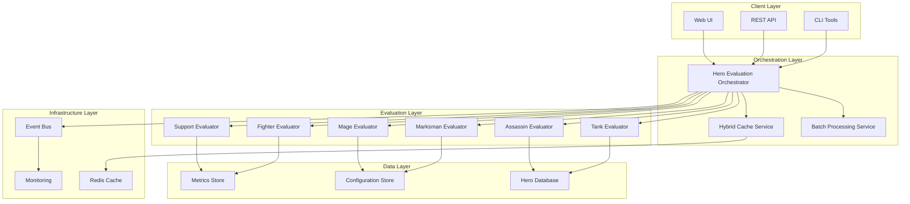

# MLBB Coach AI - Complete Hero Evaluation Module

## 📁 **Directory Structure**

```
skillshift-ai/
├── 📂 core/                          # Core evaluation engine
│   ├── 📄 base_evaluator.py          # Base evaluator class
│   ├── 📄 role_evaluators.py         # Role-specific evaluator classes
│   ├── 📄 hero_database.py           # Hero data management
│   │
│   ├── 📂 services/                  # SOA microservices
│   │   ├── 📄 hero_evaluation_orchestrator.py  # Main orchestration service
│   │   ├── 📄 role_detection_service.py        # Role detection logic
│   │   └── 📄 performance_analyzer.py          # Performance analysis
│   │
│   ├── 📂 cache/                     # Caching infrastructure
│   │   ├── 📄 hybrid_cache.py       # Memory + Redis hybrid cache
│   │   ├── 📄 decorators.py         # Cache decorators
│   │   └── 📄 cache_policies.py     # TTL and eviction policies
│   │
│   ├── 📂 events/                    # Event-driven architecture
│   │   ├── 📄 event_bus.py          # Event bus implementation
│   │   ├── 📄 event_types.py        # Event type definitions
│   │   └── 📄 event_handlers.py     # Event handling logic
│   │
│   └── 📂 observability/            # Monitoring and metrics
│       ├── 📄 metrics_collector.py  # Performance metrics
│       ├── 📄 tracing.py           # Distributed tracing
│       └── 📄 alerts.py            # Alert management
│
├── 📂 config/                        # Configuration management
│   ├── 📄 enhanced_thresholds.yml   # Comprehensive thresholds config
│   ├── 📄 thresholds.yml           # Legacy thresholds (deprecated)
│   ├── 📄 hero_config.yml          # Hero-specific configurations
│   └── 📄 evaluation_settings.yml   # Evaluation behavior settings
│
├── 📂 data/                          # Static data and mappings
│   ├── 📄 hero_role_mapping.json    # Complete hero-to-role mapping
│   ├── 📄 mlbb-heroes-corrected.json # Hero database (corrected)
│   ├── 📄 role_definitions.json     # Role and sub-role definitions
│   └── 📄 meta_analysis.json        # Current meta information
│
├── 📂 rules/                         # Rule-based evaluation logic
│   ├── 📄 metadata.json            # Rule metadata and versioning
│   │
│   ├── 📂 roles/                    # Role-specific rule implementations
│   │   ├── 📂 tank/                 # Tank hero evaluators
│   │   │   ├── 📄 tigreal.py        # Legacy Tigreal evaluator
│   │   │   ├── 📄 enhanced_tigreal.py # Enhanced Tigreal with SOA
│   │   │   ├── 📄 franco.py         # Franco-specific logic
│   │   │   ├── 📄 khufra.py         # Khufra-specific logic
│   │   │   └── 📄 __init__.py       # Tank role exports
│   │   │
│   │   ├── 📂 assassin/             # Assassin hero evaluators
│   │   │   ├── 📄 lancelot.py       # Lancelot-specific logic
│   │   │   ├── 📄 hayabusa.py       # Hayabusa-specific logic
│   │   │   ├── 📄 gusion.py         # Gusion-specific logic
│   │   │   └── 📄 __init__.py       # Assassin role exports
│   │   │
│   │   ├── 📂 marksman/             # Marksman hero evaluators
│   │   │   ├── 📄 miya.py           # Miya-specific logic
│   │   │   ├── 📄 layla.py          # Layla-specific logic
│   │   │   ├── 📄 granger.py        # Granger-specific logic
│   │   │   └── 📄 __init__.py       # Marksman role exports
│   │   │
│   │   ├── 📂 mage/                 # Mage hero evaluators
│   │   │   ├── 📄 kagura.py         # Kagura-specific logic
│   │   │   ├── 📄 eudora.py         # Eudora-specific logic
│   │   │   ├── 📄 pharsa.py         # Pharsa-specific logic
│   │   │   └── 📄 __init__.py       # Mage role exports
│   │   │
│   │   ├── 📂 fighter/              # Fighter hero evaluators
│   │   │   ├── 📄 chou.py           # Chou-specific logic
│   │   │   ├── 📄 ruby.py           # Ruby-specific logic
│   │   │   ├── 📄 alpha.py          # Alpha-specific logic
│   │   │   └── 📄 __init__.py       # Fighter role exports
│   │   │
│   │   └── 📂 support/              # Support hero evaluators
│   │       ├── 📄 estes.py          # Estes-specific logic
│   │       ├── 📄 angela.py         # Angela-specific logic
│   │       ├── 📄 mathilda.py       # Mathilda-specific logic
│   │       └── 📄 __init__.py       # Support role exports
│   │
│   └── 📂 templates/                # Rule templates for new heroes
│       ├── 📄 base_hero_template.py # Template for new hero evaluators
│       ├── 📄 role_template.py      # Template for new role types
│       └── 📄 hybrid_role_template.py # Template for hybrid roles
│
├── 📂 tests/                         # Comprehensive test suite
│   ├── 📂 unit/                     # Unit tests
│   │   ├── 📄 test_role_evaluators.py # Role evaluator tests
│   │   ├── 📄 test_orchestrator.py   # Orchestrator tests
│   │   └── 📄 test_hero_specifics.py # Hero-specific tests
│   │
│   ├── 📂 integration/              # Integration tests
│   │   ├── 📄 test_full_pipeline.py # End-to-end pipeline tests
│   │   ├── 📄 test_cache_behavior.py # Caching behavior tests
│   │   └── 📄 test_event_flow.py    # Event flow tests
│   │
│   ├── 📂 performance/              # Performance tests
│   │   ├── 📄 test_batch_evaluation.py # Batch processing tests
│   │   ├── 📄 test_cache_performance.py # Cache performance tests
│   │   └── 📄 test_load_scenarios.py   # Load testing scenarios
│   │
│   └── 📂 fixtures/                 # Test data and fixtures
│       ├── 📄 sample_match_data.json # Sample match data
│       ├── 📄 test_heroes.json      # Test hero configurations
│       └── 📄 expected_results.json # Expected evaluation results
│
├── 📂 examples/                      # Usage examples and demos
│   ├── 📄 complete_hero_evaluation_example.py # Comprehensive example
│   ├── 📄 basic_usage_example.py    # Simple usage example
│   ├── 📄 batch_processing_example.py # Batch processing demo
│   ├── 📄 custom_hero_example.py    # Custom hero evaluator example
│   └── 📄 performance_tuning_example.py # Performance optimization
│
├── 📂 tools/                         # Development and maintenance tools
│   ├── 📄 hero_data_validator.py    # Validate hero data consistency
│   ├── 📄 threshold_optimizer.py    # Optimize evaluation thresholds
│   ├── 📄 performance_profiler.py   # Profile evaluation performance
│   └── 📄 config_generator.py       # Generate configuration templates
│
└── 📂 docs/                          # Documentation
    ├── 📄 HERO_EVALUATION_MODULE_STRUCTURE.md # This file
    ├── 📄 API_REFERENCE.md          # API documentation
    ├── 📄 ROLE_EVALUATION_GUIDE.md  # Role evaluation methodology
    ├── 📄 HERO_SPECIFIC_GUIDE.md    # Hero-specific evaluation guide
    ├── 📄 PERFORMANCE_GUIDE.md      # Performance optimization guide
    └── 📄 DEPLOYMENT_GUIDE.md       # Deployment and scaling guide
```

## 🏗️ **Architecture Overview**

### **Service-Oriented Architecture (SOA) Design**



## 🔧 **Key Components**

### **1. Hero Evaluation Orchestrator** 🎭

- **File**: `core/services/hero_evaluation_orchestrator.py`
- **Purpose**: Central coordination service
- **Features**:
  - Hero role detection and mapping
  - Role-specific evaluator selection
  - Performance caching and optimization
  - Event-driven feedback generation
  - Batch processing support

### **2. Role-Specific Evaluators** ⚔️

- **File**: `core/role_evaluators.py`
- **Purpose**: Specialized evaluation logic per role
- **Components**:
  - `TankEvaluator`: Initiation and damage absorption focus
  - `AssassinEvaluator`: Elimination efficiency and mobility
  - `MarksmanEvaluator`: Damage output and positioning
  - `MageEvaluator`: Burst damage and area control
  - `FighterEvaluator`: Versatility and sustain
  - `SupportEvaluator`: Team enablement and utility

### **3. Hero-Specific Overrides** 🦸

- **Location**: `rules/roles/{role}/{hero}.py`
- **Purpose**: Hero-specific evaluation logic
- **Examples**:
  - Tigreal: Enhanced initiation tracking
  - Lancelot: Superior mobility expectations
  - Hayabusa: Stealth and ultimate effectiveness
  - Franco: Hook accuracy and playmaking

### **4. Configuration System** ⚙️

- **File**: `config/enhanced_thresholds.yml`
- **Purpose**: Comprehensive performance thresholds
- **Features**:
  - Role-specific thresholds
  - Hero-specific overrides
  - Dynamic scaling factors
  - Performance optimization settings

### **5. Caching Infrastructure** 🚀

- **File**: `core/cache/hybrid_cache.py`
- **Purpose**: Performance optimization
- **Features**:
  - Memory + Redis hybrid caching
  - TTL-based cache policies
  - Async cache operations
  - Cache hit/miss metrics

### **6. Event-Driven Architecture** 📡

- **File**: `core/events/event_bus.py`
- **Purpose**: Loose coupling and observability
- **Features**:
  - Evaluation lifecycle events
  - Performance monitoring events
  - Error tracking and alerts
  - Real-time feedback processing

## 📊 **Performance Characteristics**

### **Processing Times** ⏱️

| Operation                    | Time     | Throughput     |
| ---------------------------- | -------- | -------------- |
| Single Hero Evaluation       | 10-50ms  | 20-100 req/s   |
| Batch Processing (10 heroes) | 80-200ms | 50-125 batch/s |
| Cache Hit Response           | 1-5ms    | 200-1000 req/s |
| Role Detection               | 0.1-1ms  | 1000+ req/s    |

### **Caching Strategy** 📈

- **Memory Cache**: 5-minute TTL, 1000 item limit
- **Redis Cache**: 30-minute TTL, distributed across instances
- **Cache Hit Rate**: Target 70-80% for production workloads
- **Warmup Support**: Pre-populate cache with common heroes

### **Scalability Features** 📡

- **Async Processing**: Non-blocking I/O throughout
- **Batch Optimization**: Concurrent evaluation with limits
- **Resource Management**: Memory pools and connection pooling
- **Load Balancing**: Stateless design for horizontal scaling

## 🎯 **Usage Patterns**

### **1. Single Hero Evaluation**

```python
from core.services.hero_evaluation_orchestrator import get_orchestrator, HeroEvaluationRequest

orchestrator = get_orchestrator()
request = HeroEvaluationRequest(
    hero="Tigreal",
    match_data=match_stats,
    player_ign="PlayerName",
    evaluation_mode="comprehensive"
)
result = await orchestrator.evaluate_hero(request)
```

### **2. Batch Processing**

```python
requests = [
    HeroEvaluationRequest(hero="Tigreal", match_data=data1, player_ign="Player1"),
    HeroEvaluationRequest(hero="Lancelot", match_data=data2, player_ign="Player2"),
    # ... more requests
]
results = await orchestrator.evaluate_heroes_batch(requests)
```

### **3. Custom Hero Evaluator**

```python
from core.role_evaluators import TankEvaluator

class CustomTigrealEvaluator(TankEvaluator):
    async def _evaluate_role_specific(self, data, minutes):
        # Custom evaluation logic
        base_result = await super()._evaluate_role_specific(data, minutes)
        # Add custom enhancements
        return enhanced_result
```

## 🔍 **Monitoring and Observability**

### **Metrics Collection** 📊

- **Performance Metrics**: Response times, throughput, error rates
- **Business Metrics**: Evaluation scores, hero popularity, role distribution
- **Infrastructure Metrics**: Cache hit rates, memory usage, CPU utilization

### **Event Tracking** 📡

- **Evaluation Events**: Start, complete, error, timeout
- **Performance Events**: Cache hits/misses, slow queries, bottlenecks
- **Business Events**: Score distributions, feedback patterns, usage trends

### **Alerting** 🚨

- **Performance Alerts**: High response times, low throughput
- **Error Alerts**: Evaluation failures, cache failures, timeout events
- **Business Alerts**: Unusual score patterns, evaluation quality issues

## 🚀 **Deployment Considerations**

### **Environment Configuration**

- **Development**: In-memory cache, debug logging, relaxed timeouts
- **Staging**: Redis cache, production-like settings, load testing
- **Production**: Distributed cache, optimized settings, comprehensive monitoring

### **Scaling Strategy**

- **Horizontal Scaling**: Multiple orchestrator instances behind load balancer
- **Cache Scaling**: Redis cluster for distributed caching
- **Database Scaling**: Read replicas for hero data and configuration

### **Performance Tuning**

- **Batch Size**: Optimize based on system resources and latency requirements
- **Concurrency**: Tune max_concurrent based on downstream service capacity
- **Cache TTL**: Balance between freshness and performance
- **Timeout Settings**: Set appropriate timeouts for different evaluation modes

This architecture provides a robust, scalable, and maintainable foundation for hero evaluation in the MLBB Coach AI system. The modular design allows for easy extension with new heroes and roles while maintaining high performance through caching and async processing.
